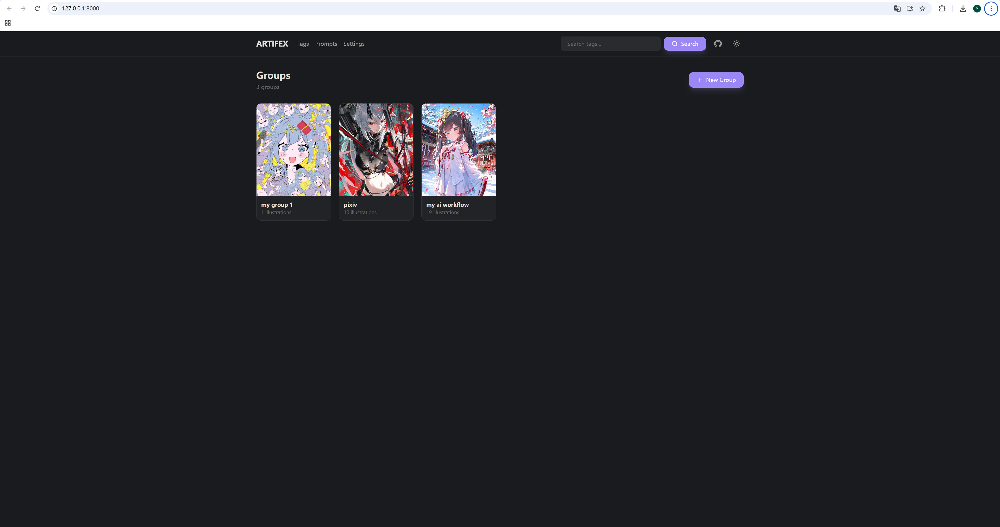
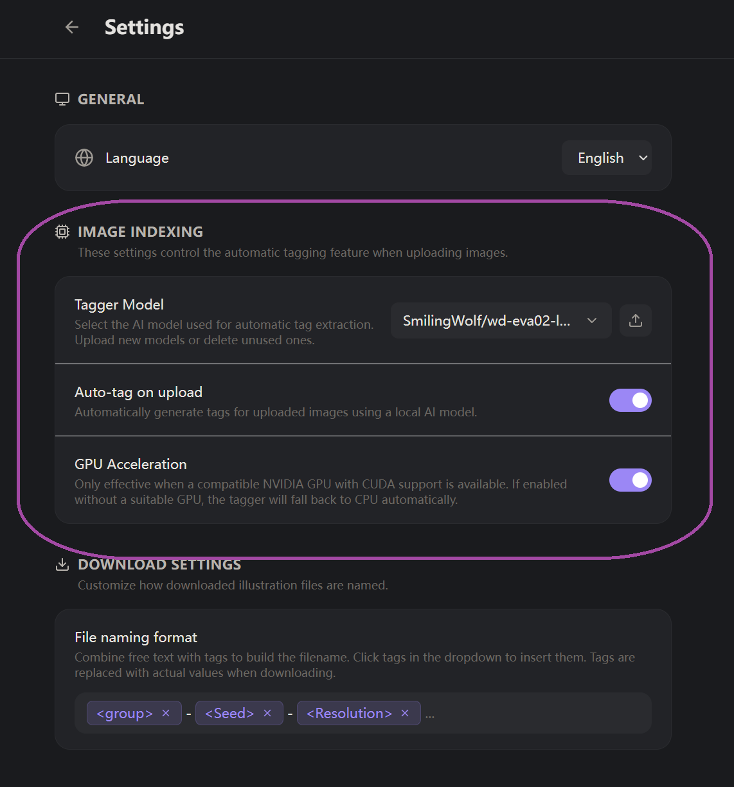

# ARTIFEX

<div align="center">

[](README.md)
[](readme/readme_zh.md)

</div>

**Artifex** is a self-hosted image management tool designed for art enthusiasts and creators. It helps you organize, search, and browse your ComfyUI-generated illustrations with powerful tagging, metadata extraction, and visual grouping features.

---


## Features

### Global Tag Search

A blazing-fast full-text search engine powered by SQLite FTS5. Type any keyword into the search bar — available from every page — and instantly find every illustration whose tags match. Prefix matching means partial terms work too: type "suns" and you get "sunset", "sunshine", "sunlight".

<!-- Screenshot: placeholder for search bar / search results -->


### AI-Powered Auto-Tagging

Upload images and let the built-in [WD EVA02-Large Tagger v3](https://huggingface.co/SmilingWolf/wd-eva02-large-tagger-v3) (~800 MB) automatically generate descriptive tags. Supports GPU acceleration (CUDA) for faster processing, with automatic CPU fallback. You can also upload custom tagger models if you prefer a different one.

Auto-tagging can be toggled on/off globally in Settings — useful when you only want manual tags.

<!-- Screenshot: placeholder for settings page with auto-tag toggle -->
<!--  -->

### ComfyUI Metadata Extraction

Images generated through ComfyUI embed rich metadata — Gallery reads it all. For each illustration, the following properties are automatically extracted and displayed:

| Property | Example |
|----------|---------|
| **Model** | `dreamshaperXL_v21.safetensors` |
| **Positive Prompt** | Full text of the positive prompt |
| **Negative Prompt** | Full text of the negative prompt |
| **Seed** | `3478264912` |
| **Sampler** | `DPM++ 2M Karras` |
| **Scheduler** | `Karras` |
| **Steps** | `20` |
| **CFG Scale** | `7.0` |
| **LoRAs** | Name and strength values for each LoRA used |
| **Resolution** | `1920 x 1080` |
| **File Size** | `2.4 MB` |
| **Date** | File creation timestamp |

All metadata is viewable in the Lightbox details panel (press `Ctrl+D` to toggle).

<!-- Screenshot: placeholder for lightbox with metadata panel open -->
<!--  -->

### Custom Tag Editing

Tags aren't just read-only — you can edit them. In the Lightbox details panel, click the pencil icon to enter edit mode, then add or remove tags with autocomplete suggestions drawn from all existing tags across your entire library. Press Enter to add a tag, Save to persist.

Custom tags you add are immediately discoverable through the global search, the tags browser, and the in-page filter — they integrate seamlessly with every tag-aware feature.

<!-- Screenshot: placeholder for tag editing in lightbox -->
<!--  -->

### Mutually Exclusive Color Grouping (Visual Clustering)

This is Gallery's signature organizing feature. Define **keyword pairs** — each pair specifies a set of keywords that must all match for an illustration to belong to that group. Illustrations are assigned to the **first** matching pair, making groups mutually exclusive. Anything unmatched falls into the "Other" group.

Each group gets a distinct color, and groups are rendered as **collapsible colored containers** — visually separating different themes, characters, or styles at a glance.

- **Tag-based groups**: match against illustration tags (auto-generated or custom)
- **Prompt-based groups**: match against the Positive and Negative Prompt text extracted from ComfyUI metadata

You can switch between multiple saved grouping configurations (sets), each with its own independent group definitions.

<!-- Screenshot: placeholder for color grouping in action -->
<!--  -->

<!-- Screenshot: placeholder for group configuration modal -->
<!--  -->

### Tags & Prompts Browsers

Dedicated pages (`/tags` and `/prompts`) list every unique tag and prompt term in your library. Browse them as filterable chips — click any tag to see how many illustrations carry it, or type to narrow the list. A great way to explore your collection's vocabulary.

<!-- Screenshot: placeholder for tags page -->
<!--  -->

### Group Management

Organize illustrations into **Groups** (think of them as albums or projects). Each group can have a cover illustration and shows a live count of its contents. Create, rename, or delete groups — deleting a group cascades to remove all its illustrations and files.

<!-- Screenshot: placeholder for home page with group grid -->
<!--  -->

### Multi-Select & Batch Operations

Select illustrations using familiar keyboard shortcuts:
- **Click** to view in the Lightbox
- **Ctrl+Click** to toggle individual selection
- **Shift+Click** to range-select between two points

Once selected, batch **download** (with customizable file naming) or batch **delete** in one action.

<!-- Screenshot: placeholder for batch selection -->
<!--  -->

### Custom Download Naming

Configure how downloaded files are named using a flexible template system. Insert placeholders like `<Model>`, `<Seed>`, `<Steps>`, `<Sampler>`, `<Resolution>`, `<Date>`, `<Group>`, and more — they are replaced with actual values from each illustration's data and metadata when downloading.

<!-- Screenshot: placeholder for download naming format settings -->
<!--  -->

### Multi-Quality Thumbnails

Three quality levels for browsing — switch on the fly with the Quality dropdown:

| Quality | Max Size | Use Case |
|---------|----------|----------|
| **Low** | 400 px | Fast browsing, large pages |
| **Normal** | 1200 px | Balanced detail & performance |
| **Original** | Full size | Pixel-level inspection |

Thumbnails are generated on upload. Missing quality levels for pre-existing images are auto-generated on first request.

### Lightbox Viewer

Click any illustration to open the full-screen Lightbox. Navigate with arrow keys, toggle the details panel (`Ctrl+D`) to see file info, ComfyUI metadata, and tags. Set the current image as the group cover or delete it directly.

<!-- Screenshot: placeholder for lightbox view -->
<!--  -->

### Sort, Filter & Pagination

Inside any group or search result:
- **Sort** by resolution, file size, or date created (ascending/descending)
- **Filter** in-page by tags or prompt terms with autocomplete (works alongside color grouping)
- **Paginate** with configurable page sizes: 50, 100, 200, 500, 1000, or All

### Sequential Upload with Progress

Upload multiple images at once — they are processed one by one with a live progress bar showing filename and percentage. Failed files are reported but don't block the rest of the batch.

### Dark & Light Themes

Switch between dark and light color schemes with a single click. Your preference is persisted across sessions. Both themes are carefully designed with semantic color tokens for consistent, readable interfaces.

<!-- Screenshot: placeholder for dark mode -->
<!--  -->

<!-- Screenshot: placeholder for light mode -->
<!--  -->

### Internationalization (i18n)

Built-in support for **English** and **中文 (Chinese)**. All user-facing text is keyed through the translation system. Switch languages in Settings — the change applies instantly without a page reload.

---

## Quick Start

### Prerequisites

- **Python 3.10+** with `pip`
- **Node.js 18+** with `npm`
- (Optional) NVIDIA GPU with CUDA for accelerated AI tagging

### Development Mode (Two Servers)

```bash
# Terminal 1 — Backend
cd backend
python -m venv venv
venv\Scripts\activate        # Windows
# source venv/bin/activate   # Linux / macOS
pip install -r requirements.txt
python -m uvicorn main:app --host 127.0.0.1 --port 8000 --reload

# Terminal 2 — Frontend
cd frontend
npm install
npm start                    # Starts on http://localhost:3000
```

- **Backend** → `http://localhost:8000` (Swagger docs at `/docs`)
- **Frontend** → `http://localhost:3000`

### Production Mode (Single Server)

```bash
cd frontend && npm run build   # Produces build/ directory
cd ../backend
python -m uvicorn main:app --host 127.0.0.1 --port 8000
# Visit http://127.0.0.1:8000 — both frontend and API served from one origin
```

---

## Tech Stack

| Layer | Technology |
|-------|-----------|
| **Backend** | Python, FastAPI, SQLite (with FTS5) |
| **AI Tagging** | PyTorch, timm, HuggingFace Hub |
| **Frontend** | React 19, Tailwind CSS 3, Framer Motion, Lucide React |
| **Routing** | React Router v7 |
| **Image Processing** | Pillow (PIL) |

---

## License

[MIT](LICENSE)
